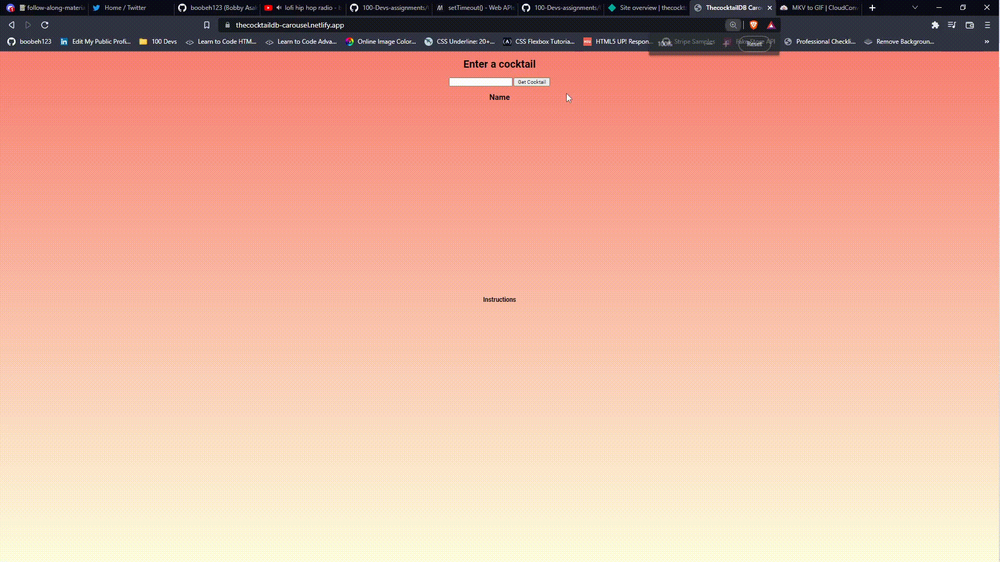

## Two assignments:

 "Make the cocktailDB api work with spaces between the names!" 
 
 &

 "Make a rotating list of drinks (an automatic carousel) from the cocktailDB code:"

## Spaces Solution
 * https://thecocktaildb-spaces.netlify.app/
 
 ## Carousel Solution
* https://thecocktaildb-carousel.netlify.app/

## Demos

## Code
The code for these two solutions are in the folders above. 
I provided comments/pseudocode to see what's going on at first glance
